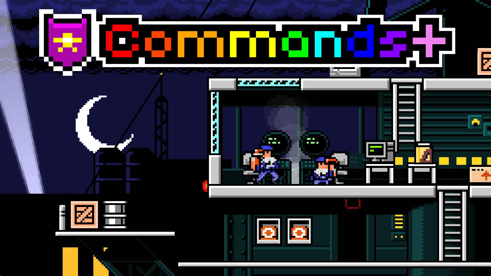

<div align="center">

[](https://store.steampowered.com/app/855860)

# Commands++

Modular, persistent chat commands for Superfighters Deluxe

[](LICENSE.txt)



</div>

An extension script that adds a rich set of chat commands to Superfighters Deluxe. 

Everything is organized into modules that can be individually allowed or restricted to the host and your choices are remembered between sessions via local storage.

Use `/modules` to see all modules, `/commands [module]` to browse help, and `/toggle_module` to control them.

Required parameters are shown with `<>`, optional with `[]`, choices with `{}`.

## 🧩 Modules

### Management

The control center. Browse commands and manage other modules. Always available and cannot be restricted.

| Command | Description |
|---------|-------------|
| `/modules` | Display all modules along with whether they are allowed or restricted. |
| `/commands [module]` | Display all commands along with their help. If a module is provided, then display only that module's commands and help. |
| `/toggle_module <module>` | Toggles whether a module is restricted. Restricted modules have all their commands limited to the host. Host-only, persisted. |
| `/reset_modules` | Resets all modules to their default allowed state. Host-only, persisted. |

### Automation

Schedule commands to run automatically when events happen. Great for announcements, cleanup or timed effects. Host only. Any command works, including built-in game commands.

| Command | Description |
|---------|-------------|
| `/jobs` | Lists all jobs along with their index, trigger, arguments and command. |
| `/add_job {startup\|shutdown\|gameover\|spawn\|time} <args> <command...>` | Adds a job that runs a command on a certain trigger. Arguments depend on the trigger. |
| `/remove_job <index>` | Removes the job with the given index. Use `*` to remove all. |

#### Examples

```sh
/add_job startup /msg Welcome to the arena!
# Runs once every time the map loads.

/add_job time 30000 0 /msg 30 seconds have passed!
# Repeats every 30 seconds forever (0 = unlimited).

/add_job time 60000 3 /refill_all true
# Revives everyone every 60 seconds, three times.

/add_job spawn /msg A new fighter has spawned!
# Runs whenever a player spawns.

/add_job shutdown /msg Good game!
# Runs when the map unloads.

/add_job gameover /msg The round is over!
# Runs when the round ends.
```

Each job is stored as a trigger type plus trigger arguments, command name and command arguments. Removing a job rebuilds the lists, so indexes shift after `/remove_job`.

### Gameplay

Change how the match itself behaves. Persistent rules like respawns and physics that stay on until you turn them off. Host only.

| Command | Description |
|---------|-------------|
| `/respawn <delay>` | Sets the custom respawn delay. Set to `0` or below to disable. |
| `/speech [true\|false]` | Toggles custom speech bubbles above players. Second parameter plays a sound when speech appears (default to `false`). |
| `/grab [true\|false]` | Toggles or sets whether players are able to grab and throw each other. |
| `/throw [true\|false]` | Toggles or sets whether players can throw objects. |
| `/dmg_numbers [true\|false] [players\|objects\|all]` | Toggles or sets whether damage is displayed. |
| `/dropin <delay>` | Sets the drop-in spawn delay. Set to `0` or below to disable. |
| `/gmover {true\|false\|players}` | Controls automatic victory detection, i.e. whether the round may end. Host-only. `true`/`false` enables or disables game over for the current round (not persisted), `players` enables players-only mode — the round ends automatically when only bots are left (persisted). |
| `/weather <none\|snow\|rain>` | Sets the weather. Moderator-only, not persisted. |
| `/clear_obj <id>` | Removes all objects with the given ID. Moderator-only. |
| `/wpnspawn [true\|false]` | Toggles or sets whether weapons spawn on the map. Moderator-only, not persisted. |
| `/camera {static\|dynamic\|individual} [zoom]` | Sets camera type and optional zoom level for the current round. Not persisted. |
| `/rsboard` | Resets the stored win ratio statistics. Moderator-only. |
| `/refill_all [true\|false]` | Toggles or sets whether ammo is constantly refilled for all players. |
| `/regen <hp>` | Sets health regenerated per second for all players. Set to `0` or below to disable. |
| `/gravity <constant>` | Sets a constant applied to gravity. Set to `0` to disable. |
| `/friendly_fire` | Toggles friendly fire. |

### Spectation

Choose who plays and who watches. Ideal for lobbies and tournaments. Restricted by default.

| Command | Description |
|---------|-------------|
| `/spec [user]` | Toggles spectation for next round. Moderators can force-spectate a user. |
| `/spec_wl` | Toggles whitelist-only mode. Moderator-only. |
| `/spec_add <user>` | Adds user to whitelist. Moderator-only. |
| `/spec_rm <account>` | Removes account from whitelist (`*` clears all). Moderator-only. |

### Player

Moderator tools to directly control players, their gear and movement.

| Command | Description |
|---------|-------------|
| `/noclip <player>` | Toggles noclip for a player, allowing them to pass through walls. |
| `/fly <player>` | Toggles flying for a player. |
| `/kill <player>` | Kills a player. |
| `/gib <player>` | Gibs a player. |
| `/remove <player>` | Removes a player. |
| `/dmg <player> <amount>` | Deals damage to a player. |
| `/notarget <player>` | Toggles whether bots target a player. |
| `/revive <player>` | Revives a dead player. |
| `/input <player>` | Toggles whether a player can provide input, effectively freezing or unfreezing them. |
| `/tp <to>` | Teleports you to a player. |
| `/tphere <player>` | Teleports a player to you. |
| `/tppos <player> <x> <y>` | Teleports a player to a world position. |
| `/team <player> <team>` | Sets the team of a player. |
| `/trip <player>` | Trips a player, knocking them down. |
| `/pos <player>` | Displays the world position of a player. Moderator-only. |
| `/tag <player> [name\|status]` | Toggles nametag and status bar visibility for a player. |
| `/modifier <player> <modifier> <value>` | Sets a player modifier to the given value. |
| `/spawn <id>` | Spawns an object with the given ID at your position. |
| `/burn <player>` | Toggles whether a player is burning. |
| `/copy <from> <to>` | Copies one player's profile onto another player. |
| `/swap <from> <to>` | Swaps the profiles of two players. |
| `/user <from> <to>` | Swaps the users of two players. |
| `/wear <player> <slot> <name> [color1] [color2]` | Gives a player a cosmetic item in the given slot with the given colors. |
| `/action <player> <action>` | Queues an action for a player whose input is disabled. |
| `/refill <player>` | Refills a player's ammo as if they used an ammo stash. |
| `/magnet <player> [area_size] [players\|objects\|all]` | Toggles attraction of nearby players and/or objects toward a player. |
| `/repulse <player> [area_size] [players\|objects\|all]` | Toggles repulsion of nearby players and/or objects away from a player. |
| `/boost <player> <left\|down\|up\|right> [speed]` | Boosts a player in a direction. |

### Fun

Light-hearted extras and visual gags. Permission varies per command.

| Command | Description |
|---------|-------------|
| `/graffiti <text>` | Creates floating graffiti text at your position. |
| `/lightning <player>` | Summons a lightning strike upon a player. Moderator-only. |
| `/bot [team] [ai] [name]` | Spawns a robot, optionally on a given team with the given AI and name. Moderator-only. |
| `/color <player> <color>` | Recolors all of a player's clothing. Moderator-only. |
| `/bullet <player> [id]` | Sets custom bullets for a player, or disables them if no ID is given. Moderator-only. |
| `/anvil <player>` | Drops a heavy object onto a player. Moderator-only. |
| `/clone <player> [team] [ai]` | Spawns a clone of a player, optionally on a given team with the given AI. Moderator-only. |
| `/fart` | Makes you fart. |
| `/suicide` | Die dramatically. |

## ✍️ Special thanks

- [MNC](https://steamcommunity.com/id/ManiacMNC/) for the banner.
